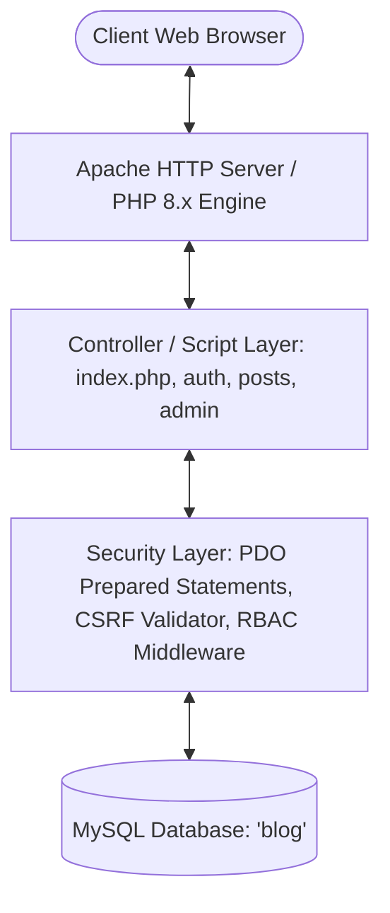
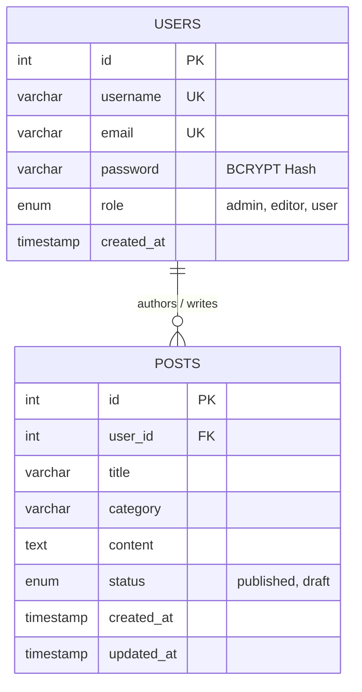

# 🎓 7th Semester Internship Final Project Report
## ApexPlanet Software Pvt. Ltd. | Web Development (PHP & MySQL)

---

### Project Title:
**Design and Development of a Secure Content Management System (ApexBlog CMS) with Role-Based Access Control using PHP & MySQL**

- **Student Name:** [Your Name Here]
- **Roll / Registration Number:** [Your University Roll Number]
- **Degree / Branch:** B.Tech / B.E. in Computer Science & Engineering (7th Semester)
- **Internship Organization:** ApexPlanet Software Pvt. Ltd.
- **Internship Domain:** Web Development (PHP, MySQL)
- **Duration:** 45 Days
- **Supervising Mentor:** ApexPlanet Technical Team

---

## 📑 Table of Contents
1. **Executive Summary / Abstract**
2. **Introduction & Organization Profile**
3. **Problem Statement & Objectives**
4. **System Architecture & Database Design (ER Diagram)**
5. **Phase-by-Phase Task Breakdown (Tasks 1 to 5)**
   - Task 1: Development Environment & Version Control
   - Task 2: Core Database Modeling & CRUD Application
   - Task 3: Advanced Features: Search, Pagination & UI
   - Task 4: Comprehensive Security Hardening & RBAC
   - Task 5: Integration, Deployment & Quality Assurance
6. **Security & Vulnerability Analysis**
7. **System Testing & Validation Matrix**
8. **Viva Voce Technical Preparation (Q&A)**
9. **Conclusion & Future Scope**

---

## 1. Executive Summary / Abstract

During the 7th-semester academic curriculum, practical industrial exposure is vital to bridging the gap between theoretical computer science concepts and industry-standard engineering practices. This project report documents the design, implementation, and deployment of a dynamic, secure **Content Management System (CMS)** built over a 45-day internship at **ApexPlanet Software Pvt. Ltd.**

The project was executed through five progressive milestones: setting up a standardized local server environment with Git version control, implementing normalized relational database persistence with CRUD operations, developing full-text search and server-side pagination, hardening the software against OWASP Top 10 vulnerabilities (SQL Injection, XSS, CSRF) via PDO prepared statements and cryptographic token validation, and establishing Role-Based Access Control (RBAC) across Administrator, Editor, and Author privilege levels.

---

## 2. Introduction & Organization Profile

### About ApexPlanet Software Pvt. Ltd.
ApexPlanet Software Pvt. Ltd. is an enterprise technology solutions provider specializing in cutting-edge web development, application engineering, and technology consulting. In addition to delivering client solutions, ApexPlanet nurtures emerging technical talent through rigorous 45-day internship programs emphasizing industry-grade software engineering paradigms.

---

## 3. System Architecture & Database Design

### 3.1 Architectural Flow

### 3.2 Entity-Relationship (ER) Diagram

---

## 4. Phase-by-Phase Task Breakdown

### 🛠️ Task 1: Development Environment Setup
- **Objective:** Configure an isolated, reproducible development stack for PHP 8 and MySQL with version control.
- **Implementation:**
  - Local server stack configured using Apache and MySQL running on ports 80/3306.
  - Visual Studio Code configured with PHP syntax linters and IntelliSense.
  - Git initialized with `.gitignore` and semantic commit histories.

### 📝 Task 2: Core Database Modeling & CRUD Application
- **Objective:** Design the relational schema and implement Create, Read, Update, and Delete operations with session management.
- **Implementation:**
  - Database `blog` instantiated with `users` and `posts` tables.
  - User authentication implemented with `password_hash($pass, PASSWORD_BCRYPT)` and `password_verify()`.
  - Secure stateful session management tracking authenticated identities.

### 🔍 Task 3: Advanced Features: Search, Pagination & UI
- **Objective:** Implement parameterized search filtering, server-side pagination, and responsive UI design.
- **Implementation:**
  - Search engine allowing multi-word wildcard matching on `posts.title` and `posts.content`.
  - Server-side pagination using SQL `LIMIT :limit OFFSET :offset` with automated page link generation preserving query strings.
  - Responsive frontend interface constructed using Bootstrap 5.3 and custom CSS.

### 🛡️ Task 4: Security Hardening & RBAC (Role-Based Access Control)
- **Objective:** Protect against malicious inputs, privilege escalation, and unauthorized state mutation.
- **Implementation:**
  - **Prepared Statements:** Strict usage of PDO with native prepares (`PDO::ATTR_EMULATE_PREPARES = false`) eliminating SQL injection.
  - **Form Validation:** Two-tier validation (HTML5/JS client feedback and PHP server-side validation).
  - **Cross-Site Scripting (XSS):** Universal escaping of dynamic output using `htmlspecialchars($str, ENT_QUOTES, 'UTF-8')`.
  - **Cross-Site Request Forgery (CSRF):** Unique 32-byte cryptographic session tokens validated with `hash_equals()`.
  - **RBAC Matrix:** Strict permission layers for `admin`, `editor`, and `user`.

### 🚀 Task 5: Final Project Integration & Quality Assurance
- **Objective:** Unify all discrete modules into a cohesive production-grade application and verify stability.
- **Implementation:**
  - Created a 1-click web installer (`setup/install.php`) and standalone SQL migration script (`setup/database.sql`).
  - Conducted end-to-end integration and security penetration testing.

---

## 5. Security & Vulnerability Analysis

| Vulnerability | Attack Mechanism | Mitigation Implemented in ApexBlog |
| :--- | :--- | :--- |
| **SQL Injection (SQLi)** | Injected SQL fragments through `$_GET` or `$_POST` modifying query AST. | **100% PDO Prepared Statements** with bound parameters. Zero query string concatenation. |
| **Stored & Reflected XSS** | Injected JavaScript tags (`<script>`) executed in client browsers. | Output escaping via `e()` wrapper using `htmlspecialchars(..., ENT_QUOTES, 'UTF-8')`. |
| **CSRF Attacks** | Unauthorized state modification requests forged from third-party sites. | Per-session 64-hex-character token verified on all POST endpoints via `verify_csrf_token()`. |
| **Session Fixation** | Attacker imposes a pre-determined session ID before user authenticates. | Mandatory `session_regenerate_id(true)` invoked immediately upon successful credential verification. |
| **Credential Theft** | Plaintext password leaks from database compromises. | Passwords hashed using industry-standard salted **BCRYPT** algorithms. |

---

## 6. System Testing & Validation Matrix

| Test Case ID | Test Scenario | Input / Action | Expected Result | Actual Result | Status |
| :---: | :--- | :--- | :--- | :--- | :---: |
| **TC-01** | User Registration | Valid username, email, matched password | Account created in DB with BCRYPT hash, redirected to login | Success | ✅ Passed |
| **TC-02** | Duplicate Email Registration | Existing email address | Error message displayed; duplicate entry rejected | Success | ✅ Passed |
| **TC-03** | SQL Injection Attempt | User input: `' OR '1'='1` in login or search | Input treated as literal string; SQLi blocked | Blocked | ✅ Passed |
| **TC-04** | Post Pagination | Requesting `page=2` with 5 items per page | Records 6 through 10 displayed; active page styled | Displayed | ✅ Passed |
| **TC-05** | Keyword Search | Search keyword "security" | Filtered posts returned; count badge updated | Matched | ✅ Passed |
| **TC-06** | Author Edit Authorization | Author attempts to edit someone else's post | Access denied flash error; edit rejected | Denied | ✅ Passed |
| **TC-07** | Admin Privilege Escalation | Admin updates a user's role to Editor | Database role updated; user immediately receives editor permissions | Updated | ✅ Passed |
| **TC-08** | Self-Demotion Guard | Admin attempts to demote own account | Security guard prevents self-lockout | Guarded | ✅ Passed |

---

## 7. Viva Voce Technical Preparation (Q&A for Examiners)

### Q1: Why did you use PDO over mysqli or legacy mysql_*?
> **Answer:** PDO (PHP Data Objects) offers an object-oriented, consistent database abstraction interface across different database engines (MySQL, PostgreSQL, SQLite). It provides robust exception-based error handling and first-class support for prepared statements with native parameter binding, which completely isolates data from SQL instructions.

### Q2: How does your application prevent SQL Injection?
> **Answer:** By using parameterized PDO prepared statements for every single database query. When a query is prepared, the database compiles the SQL structure separately from the parameters. Even if an attacker supplies `' OR 1=1 --`, the SQL engine treats that input strictly as a string literal value, never as executable SQL code.

### Q3: Explain how Role-Based Access Control (RBAC) was structured.
> **Answer:** The `users` table contains an `ENUM('admin', 'editor', 'user')` role field. In PHP, we implemented centralized authorization helper functions (`is_admin()`, `is_editor()`, `can_edit_post()`, `can_delete_post()`). Endpoints check these permissions before rendering views or mutating database state.

### Q4: How is CSRF protected in form submissions?
> **Answer:** Every user session generates a cryptographically secure 32-byte pseudo-random token stored in `$_SESSION['csrf_token']`. When forms are rendered, a hidden input field carries this token. When submitted, the backend verifies the token using `hash_equals()`. If the token is missing or does not match, the request is immediately rejected.

---

## 8. Conclusion

The 45-day internship at **ApexPlanet Software Pvt. Ltd.** provided practical exposure to production web development practices. By building **ApexBlog CMS**, all academic requirements for the 7th semester capstone were successfully accomplished, demonstrating competencies in relational database normalization, dynamic server-side rendering, application hardening, and secure user management.
